# 乒乓球培训管理系统UML图表设计

**版本：** 1.0  
**日期：** 2025年1月  
**编写人员：** 项目开发团队  

## 一、用例图设计

### 1.1 系统总体用例图

```plantuml
@startuml 系统总体用例图
!theme plain
skinparam backgroundColor white
skinparam actorStyle awesome

title 乒乓球培训管理系统总体用例图

' 定义参与者
actor "学员" as Student
actor "教练员" as Coach  
actor "校区管理员" as CampusAdmin
actor "超级管理员" as SuperAdmin

' 定义系统边界
rectangle "乒乓球培训管理系统" {
  
  ' 学员用例
  usecase "用户注册" as UC1
  usecase "用户登录" as UC2
  usecase "查询教练员" as UC3
  usecase "选择教练员" as UC4
  usecase "预约课程" as UC5
  usecase "账户充值" as UC6
  usecase "查看课表" as UC7
  usecase "取消预约" as UC8
  usecase "更换教练员" as UC9
  usecase "训练评价" as UC10
  usecase "月赛报名" as UC11
  usecase "查看比赛信息" as UC12
  usecase "查看消息通知" as UC13
  usecase "支付管理" as UC14
  usecase "申请退费" as UC15
  usecase "查看账户余额" as UC16
  usecase "查看交易记录" as UC17
  
  ' 教练员用例
  usecase "教练员注册" as UC19
  usecase "审核学员申请" as UC20
  usecase "确认课程预约" as UC21
  usecase "拒绝课程预约" as UC22
  usecase "维护个人信息" as UC23
  usecase "学员训练评价" as UC24
  usecase "查看课程安排" as UC25
  usecase "管理课程表" as UC26
  
  ' 校区管理员用例
  usecase "管理学员信息" as UC28
  usecase "管理教练信息" as UC29
  usecase "审核教练注册" as UC30
  usecase "管理课程预约" as UC31
  usecase "查询系统日志" as UC32
  usecase "线下充值录入" as UC33
  usecase "审核充值申请" as UC34
  usecase "管理比赛" as UC35
  usecase "创建比赛分组" as UC36
  usecase "生成比赛赛程" as UC37
  usecase "记录比赛结果" as UC38
  usecase "发送系统通知" as UC39
  
  ' 超级管理员用例
  usecase "管理校区信息" as UC40
  usecase "指定校区负责人" as UC41
  usecase "系统全局管理" as UC42
  usecase "审核退费申请" as UC43
  usecase "批量发送通知" as UC44
}

' 学员关联
Student --> UC1
Student --> UC2
Student --> UC3
Student --> UC4
Student --> UC5
Student --> UC6
Student --> UC7
Student --> UC8
Student --> UC9
Student --> UC10
Student --> UC11
Student --> UC12
Student --> UC13
Student --> UC14
Student --> UC15
Student --> UC16
Student --> UC17


' 教练员关联
Coach --> UC2
Coach --> UC19
Coach --> UC20
Coach --> UC21
Coach --> UC22
Coach --> UC23
Coach --> UC24
Coach --> UC25
Coach --> UC26
Coach --> UC27
Coach --> UC13

' 校区管理员关联
CampusAdmin --> UC2
CampusAdmin --> UC28
CampusAdmin --> UC29
CampusAdmin --> UC30
CampusAdmin --> UC31
CampusAdmin --> UC32
CampusAdmin --> UC33
CampusAdmin --> UC34
CampusAdmin --> UC35
CampusAdmin --> UC36
CampusAdmin --> UC37
CampusAdmin --> UC38
CampusAdmin --> UC39
CampusAdmin --> UC13

' 超级管理员关联
SuperAdmin --> UC2
SuperAdmin --> UC40
SuperAdmin --> UC41
SuperAdmin --> UC42
SuperAdmin --> UC43
SuperAdmin --> UC44
SuperAdmin --> UC13

' 包含关系
UC4 ..> UC3 : <<include>>
UC5 ..> UC4 : <<include>>
UC8 ..> UC5 : <<include>>
UC11 ..> UC6 : <<include>>
UC14 ..> UC6 : <<include>>
UC15 ..> UC14 : <<include>>
UC17 ..> UC16 : <<include>>
UC36 ..> UC35 : <<include>>
UC37 ..> UC36 : <<include>>

' 扩展关系
UC21 <.. UC31 : <<extend>>
UC22 <.. UC31 : <<extend>>
UC34 <.. UC33 : <<extend>>
UC43 <.. UC15 : <<extend>>

@enduml
```

### 1.2 学员子系统用例图

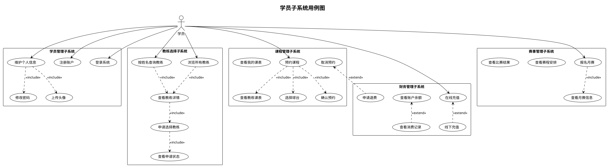

### 1.3 教练员子系统用例图

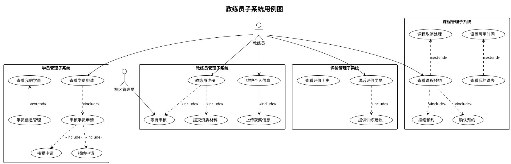

## 二、活动图设计

### 2.1 学员选择教练流程活动图

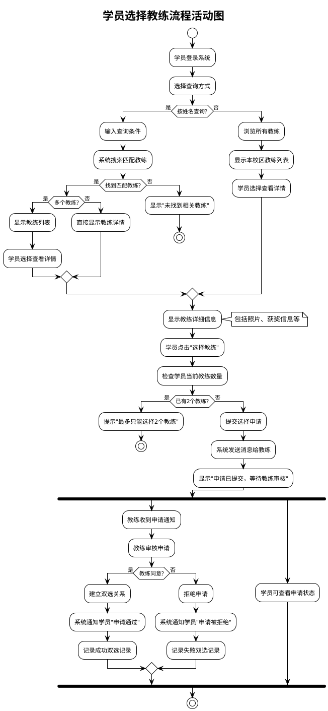

### 2.2 课程预约流程活动图

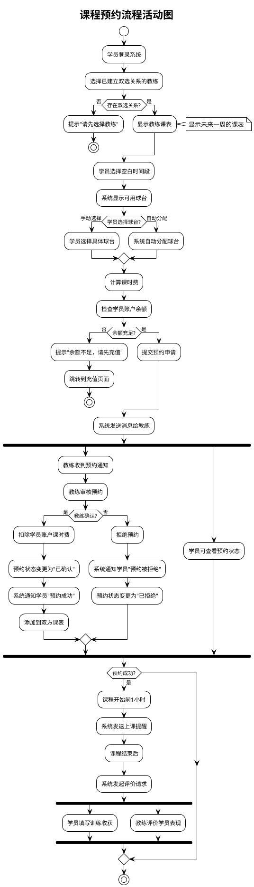

### 2.3 月赛报名流程活动图

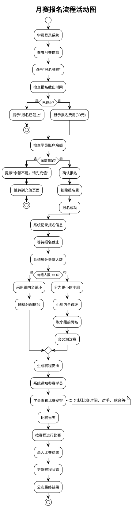

### 2.5 支付充值流程活动图

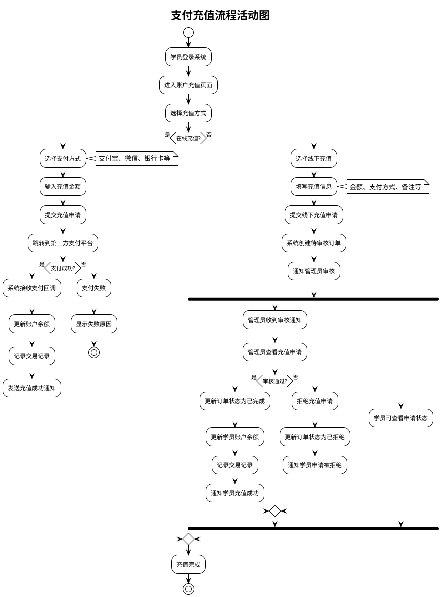

### 2.6 退费申请流程活动图

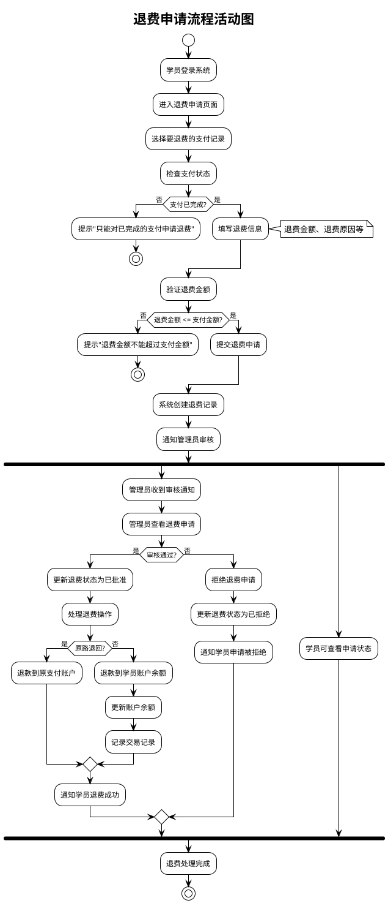

### 2.7 比赛管理流程活动图

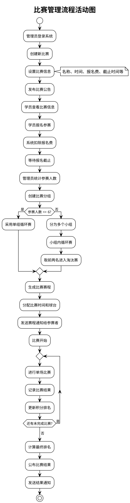

### 2.8 消息通知流程活动图

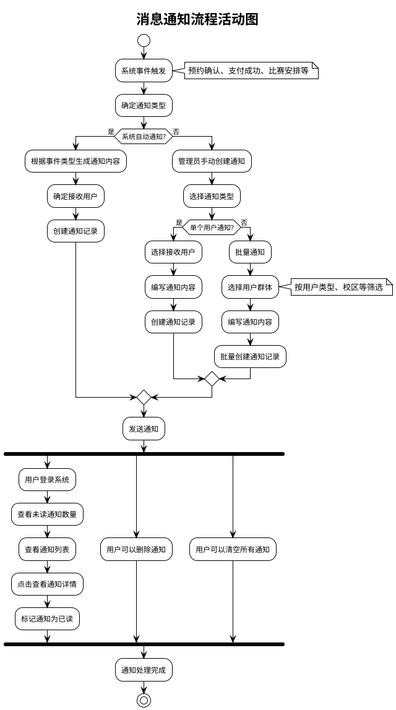

## 三、时序图设计

### 3.1 用户登录时序图

```plantuml
@startuml 用户登录时序图
!theme plain
skinparam backgroundColor white

title 用户登录时序图

participant "用户" as User
participant "登录控制器" as LoginController
participant "用户服务" as UserService
participant "数据库" as Database
participant "会话管理" as SessionManager

User -> LoginController: 输入用户名和密码
activate LoginController

LoginController -> UserService: 验证用户凭据
activate UserService

UserService -> Database: 查询用户信息
activate Database
Database --> UserService: 返回用户数据
deactivate Database

alt 用户存在且密码正确
  UserService -> UserService: 验证密码
  UserService --> LoginController: 验证成功
  
  LoginController -> SessionManager: 创建用户会话
  activate SessionManager
  SessionManager --> LoginController: 返回会话ID
  deactivate SessionManager
  
  LoginController --> User: 登录成功，跳转到主页
else 用户不存在或密码错误
  UserService --> LoginController: 验证失败
  LoginController --> User: 显示错误信息
endif

deactivate UserService
deactivate LoginController

@enduml
```

### 3.3 支付充值时序图

```plantuml
@startuml 支付充值时序图
!theme plain
skinparam backgroundColor white

title 支付充值时序图

participant "学员" as Student
participant "支付控制器" as PaymentController
participant "支付服务" as PaymentService
participant "账户服务" as AccountService
participant "第三方支付" as ThirdPartyPayment
participant "消息服务" as MessageService
participant "数据库" as Database

Student -> PaymentController: 提交充值申请
activate PaymentController

PaymentController -> PaymentService: 处理充值请求
activate PaymentService

PaymentService -> Database: 创建支付记录
activate Database
Database --> PaymentService: 返回支付ID
deactivate Database

alt 在线支付
  PaymentService -> ThirdPartyPayment: 调用支付接口
  activate ThirdPartyPayment
  ThirdPartyPayment --> PaymentService: 返回支付链接
  deactivate ThirdPartyPayment
  
  PaymentService --> PaymentController: 返回支付链接
  PaymentController --> Student: 跳转到支付页面
  
  Student -> ThirdPartyPayment: 完成支付
  activate ThirdPartyPayment
  ThirdPartyPayment -> PaymentService: 支付回调通知
  activate PaymentService
  
  PaymentService -> Database: 更新支付状态
  activate Database
  Database --> PaymentService: 更新成功
  deactivate Database
  
  PaymentService -> AccountService: 更新账户余额
  activate AccountService
  AccountService -> Database: 更新余额和交易记录
  activate Database
  Database --> AccountService: 更新成功
  deactivate Database
  AccountService --> PaymentService: 余额更新成功
  deactivate AccountService
  
  PaymentService -> MessageService: 发送充值成功通知
  activate MessageService
  MessageService --> PaymentService: 通知发送成功
  deactivate MessageService
  
  PaymentService --> ThirdPartyPayment: 确认回调处理
  deactivate PaymentService
  ThirdPartyPayment --> Student: 显示支付成功
  deactivate ThirdPartyPayment

else 线下支付
  PaymentService -> Database: 创建待审核记录
  activate Database
  Database --> PaymentService: 记录创建成功
  deactivate Database
  
  PaymentService -> MessageService: 通知管理员审核
  activate MessageService
  MessageService --> PaymentService: 通知发送成功
  deactivate MessageService
  
  PaymentService --> PaymentController: 申请提交成功
  PaymentController --> Student: 显示"等待审核"
endif

deactivate PaymentService
deactivate PaymentController

@enduml
```

### 3.4 比赛报名时序图

```plantuml
@startuml 比赛报名时序图
!theme plain
skinparam backgroundColor white

title 比赛报名时序图

participant "学员" as Student
participant "比赛控制器" as CompetitionController
participant "比赛服务" as CompetitionService
participant "账户服务" as AccountService
participant "消息服务" as MessageService
participant "数据库" as Database

Student -> CompetitionController: 提交报名申请
activate CompetitionController

CompetitionController -> CompetitionService: 处理报名请求
activate CompetitionService

CompetitionService -> Database: 检查比赛状态和报名截止时间
activate Database
Database --> CompetitionService: 返回比赛信息
deactivate Database

alt 报名未截止
  CompetitionService -> Database: 检查是否已报名
  activate Database
  Database --> CompetitionService: 返回报名状态
  deactivate Database
  
  alt 未报名
    CompetitionService -> Database: 检查参赛人数限制
    activate Database
    Database --> CompetitionService: 返回当前报名人数
    deactivate Database
    
    alt 未达到人数限制
      CompetitionService -> AccountService: 检查账户余额
      activate AccountService
      AccountService -> Database: 查询账户余额
      activate Database
      Database --> AccountService: 返回余额信息
      deactivate Database
      AccountService --> CompetitionService: 余额检查结果
      deactivate AccountService
      
      alt 余额充足
        CompetitionService -> Database: 创建报名记录
        activate Database
        Database --> CompetitionService: 报名记录创建成功
        deactivate Database
        
        CompetitionService -> AccountService: 扣除报名费
        activate AccountService
        AccountService -> Database: 更新余额和交易记录
        activate Database
        Database --> AccountService: 扣费成功
        deactivate Database
        AccountService --> CompetitionService: 扣费完成
        deactivate AccountService
        
        CompetitionService -> MessageService: 发送报名成功通知
        activate MessageService
        MessageService --> CompetitionService: 通知发送成功
        deactivate MessageService
        
        CompetitionService --> CompetitionController: 报名成功
        CompetitionController --> Student: 显示"报名成功"
      else 余额不足
        CompetitionService --> CompetitionController: 余额不足
        CompetitionController --> Student: 提示充值
      endif
    else 人数已满
      CompetitionService --> CompetitionController: 报名已满
      CompetitionController --> Student: 显示"报名已满"
    endif
  else 已报名
    CompetitionService --> CompetitionController: 重复报名
    CompetitionController --> Student: 显示"已报名"
  endif
else 报名已截止
  CompetitionService --> CompetitionController: 报名截止
  CompetitionController --> Student: 显示"报名已截止"
endif

deactivate CompetitionService
deactivate CompetitionController

@enduml
```

## 四、类图设计

### 4.1 用户管理类图

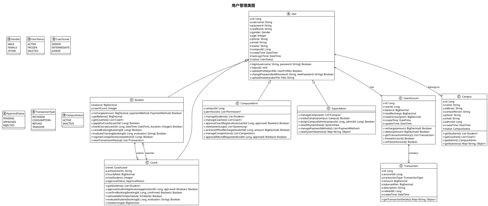

### 4.2 课程管理类图

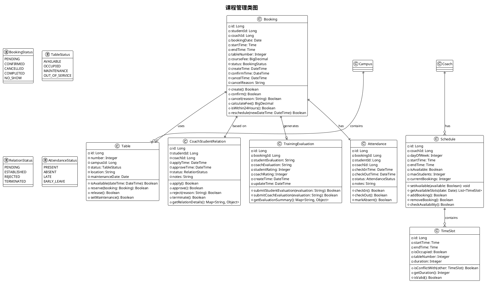

## 五、状态图设计

### 5.1 课程预约状态图

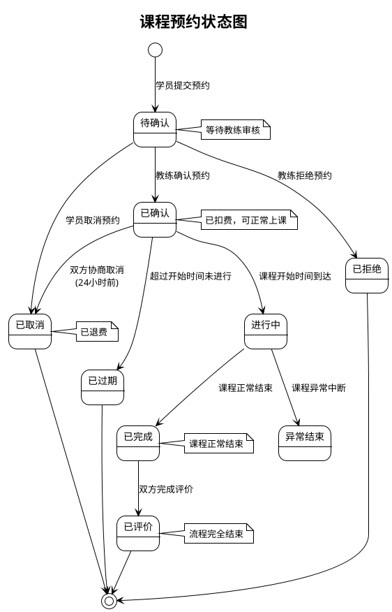

### 5.2 教练审核状态图

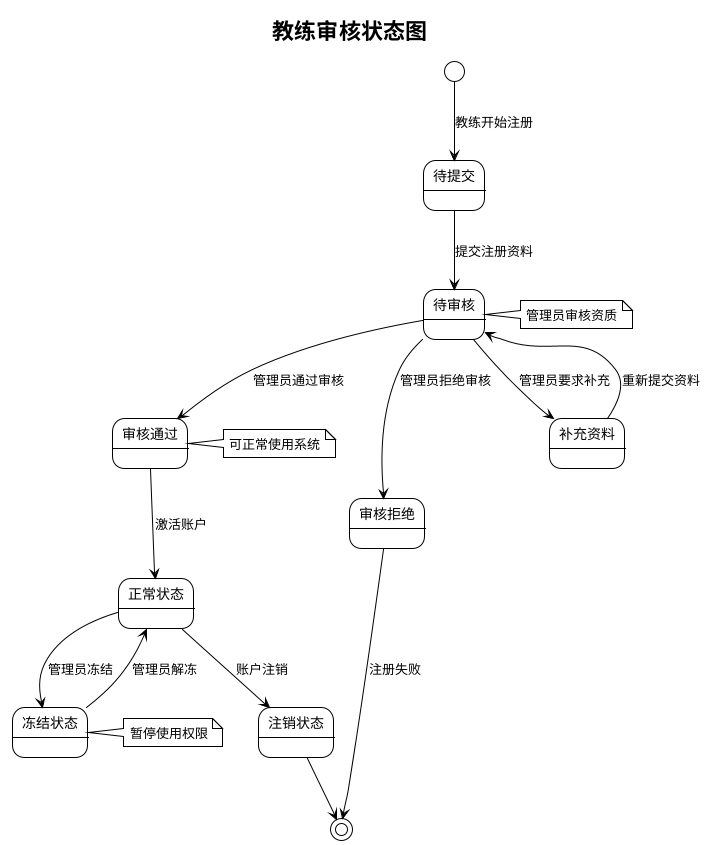


**说明：**
1. 以上UML图表使用PlantUML语法编写，可以通过PlantUML工具生成对应的图形
2. 图表涵盖了系统的主要功能模块和业务流程
3. 可根据实际开发需要进一步细化和调整图表内容
4. 建议在开发过程中持续更新和维护这些图表，确保与实际实现保持一致